# 🏥 Secure Premium Flow

> **Next-Generation Insurance Platform with Zero-Knowledge Privacy**

Transform your insurance experience with cutting-edge FHE technology. Calculate premiums, submit claims, and manage policies while keeping your most sensitive health data completely private and encrypted.

## ✨ What Makes Us Different

- 🔐 **Zero-Knowledge Privacy**: Your health data never leaves your device unencrypted
- ⚡ **Instant Premium Quotes**: Get real-time insurance quotes without data exposure
- 🌐 **Multi-Chain Ready**: Built for Ethereum with future multi-chain expansion
- 🎯 **Smart Risk Assessment**: AI-powered risk analysis on encrypted data
- 💎 **Premium User Experience**: Intuitive interface with enterprise-grade security

## 🛠️ Built With Modern Tech

| Category | Technology |
|----------|------------|
| **Frontend** | React 18 + TypeScript + Vite |
| **Styling** | Tailwind CSS + shadcn/ui |
| **Web3** | Wagmi + RainbowKit + Viem |
| **Blockchain** | Ethereum Sepolia Testnet |
| **Encryption** | FHE (Fully Homomorphic Encryption) |
| **Smart Contracts** | Solidity with Zama FHE |

## 🚀 Quick Start

### Prerequisites

- ⚡ Node.js 18+ and npm
- 🦊 Web3 wallet (MetaMask, Rainbow, etc.)
- 💰 Sepolia ETH for gas fees

### Installation

```bash
# Clone the repository
git clone https://github.com/polinaSokolov/secure-premium-flow.git

# Navigate to the project directory
cd secure-premium-flow

# Install dependencies
npm install

# Start the development server
npm run dev
```

> 💡 **Pro Tip**: Make sure you're connected to Sepolia testnet in your wallet!

### Environment Variables

Create a `.env.local` file in the root directory:

```env
NEXT_PUBLIC_CHAIN_ID=11155111
NEXT_PUBLIC_RPC_URL=https://sepolia.infura.io/v3/b18fb7e6ca7045ac83c41157ab93f990
NEXT_PUBLIC_WALLET_CONNECT_PROJECT_ID=2ec9743d0d0cd7fb94dee1a7e6d33475
NEXT_PUBLIC_INFURA_API_KEY=b18fb7e6ca7045ac83c41157ab93f990
NEXT_PUBLIC_RPC_URL=https://1rpc.io/sepolia
```

## 🔄 How It Works

```mermaid
graph TD
    A[👤 User Connects Wallet] --> B[🔐 Health Data Encryption]
    B --> C[📊 FHE Premium Calculation]
    C --> D[💎 Secure Results]
    D --> E[📝 Smart Contract Storage]
    E --> F[🎯 Policy Creation]
```



### Step-by-Step Process

1. **🔗 Connect Wallet**: Link your Web3 wallet to access the platform
2. **🛡️ Encrypt Data**: Health information is encrypted using FHE before any processing
3. **⚡ Calculate Premium**: Insurance premiums are computed on encrypted data
4. **🔒 Secure Results**: Get your quote without exposing sensitive information
5. **📋 Create Policy**: All transactions are recorded on-chain for transparency

## Smart Contracts

The platform includes FHE-enabled smart contracts for:
- Secure health data storage
- Encrypted premium calculations
- Transparent claim processing
- Reputation management

## Deployment

### Vercel Deployment

1. Connect your GitHub repository to Vercel
2. Set environment variables in Vercel dashboard
3. Deploy automatically on push to main branch

### Manual Deployment

```bash
# Build the project
npm run build

# Preview the build
npm run preview
```

## Contributing

1. Fork the repository
2. Create a feature branch
3. Make your changes
4. Submit a pull request

## License

This project is licensed under the MIT License - see the LICENSE file for details.

## Support

For support and questions, please open an issue on GitHub or contact the development team.

## Roadmap

- [ ] Multi-chain support
- [ ] Advanced FHE operations
- [ ] Mobile app development
- [ ] Integration with more insurance providers
- [ ] AI-powered risk assessment
